---
## Front matter
lang: ru-RU
title: Лабораторная работа №3
author: |
	 Аминов Зулфикор\inst{1}

institute: |
	\inst{1}Российский Университет Дружбы Народов

date: 24.09, 2022, Москва, Россия

## Formatting
mainfont: PT Serif
romanfont: PT Serif
sansfont: PT Sans
monofont: PT Mono
toc: false
slide_level: 2
theme: metropolis
header-includes: 
 - \metroset{progressbar=frametitle,sectionpage=progressbar,numbering=fraction}
 - '\makeatletter'
 - '\beamer@ignorenonframefalse'
 - '\makeatother'
aspectratio: 43
section-titles: true

---

# Цели и задачи работы

## Цель лабораторной работы

Получение практических навыков работы в консоли с атрибутами файлов для групп пользователей.

# Задание к лабораторной работе

## Упражнение

Меняя атрибуты у директории dir1 и файла file1 от имени пользова-
теля guest и делая проверку от пользователя guest2, заполните табл. 3.1,
определив опытным путём, какие операции разрешены, а какие нет. Ес-
ли операция разрешена, занесите в таблицу знак «+», если не разрешена,
знак «-».

# Выполнение работы

## Создание учетной записи пользователя guest

На прошлой работы уже создали пользователя guest.

## Создали второго пользователя guest2

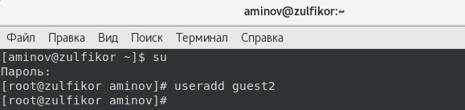{ #fig:001 width=100% height=100% }

## Задали пароль для пользователя guest2

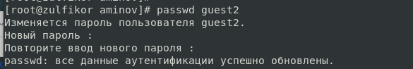{ #fig:002 width=100% height=100% }

## Добавили пользователя guest2 в группу guest:

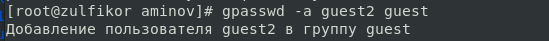{ #fig:003 width=100% height=100% }

## Входили в систему от имени пользователя guest

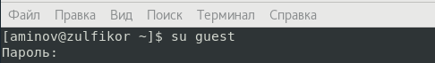{ #fig:004 width=100% height=100% }

## Входили в систему от имени пользователя guest2

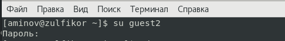{ #fig:005 width=100% height=100% }

## Для пользователя guest командой pwd определили директорию

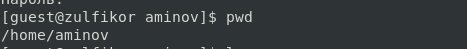{ #fig:006 width=100% height=100% }

## Для пользователя guest2 командой pwd определили директорию

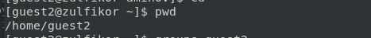{ #fig:007 width=100% height=100% }

## Уточнили имя нашего пользователя, его группу, кто входит в неё и к каким группам принадлежит он сам
и сравнили вывод команды groups с выводом команд id -Gn и id -G.

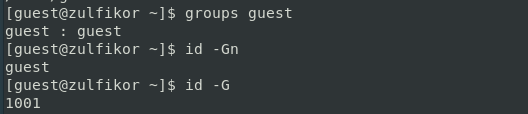{ #fig:008 width=100% height=100% }

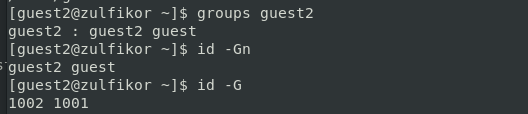{ #fig:009 width=100% height=100% }

## Сравнили полученную информацию с содержимым файла /etc/group.

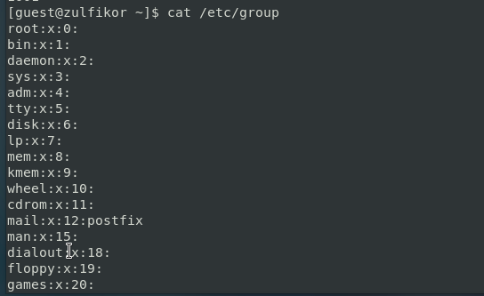{ #fig:010 width=100% height=100% }

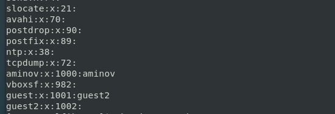{ #fig:011 width=100% height=100% }

## От имени пользователя guest2 выполнили регистрацию пользователя
guest2 в группе guest командой newgrp guest.

{ #fig:012 width=100% height=100% }

## От имени пользователя guest изменили права директории /home/guest,
разрешив все действия для пользователей группы, командой chmod g+rwx /home/guest.

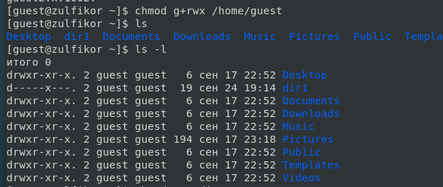{ #fig:013 width=100% height=100% }

## От имени пользователя guest снимали с директории /home/guest/dir1
все атрибуты командой chmod 000 dirl

{ #fig:014 width=100% height=100% }

## Меняя атрибуты у директории dir1 и файла file1 от имени пользова-
теля guest и делая проверку от пользователя guest2, заполнили табл. 3.1

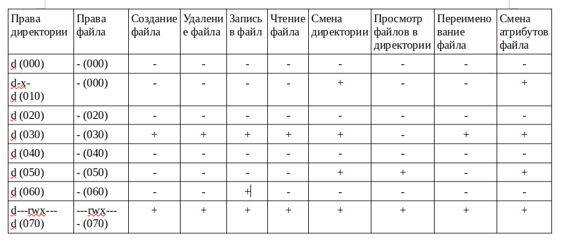{ #fig:015 width=100% height=100% }

# Выводы по проделанной работе

## Вывод

Получили практических навыков работы в консоли с атрибутами файлов для групп пользователей.

